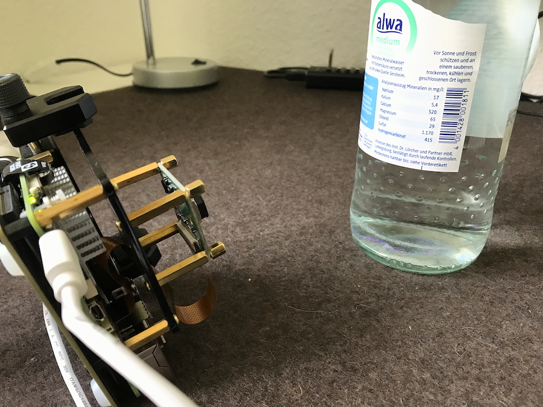
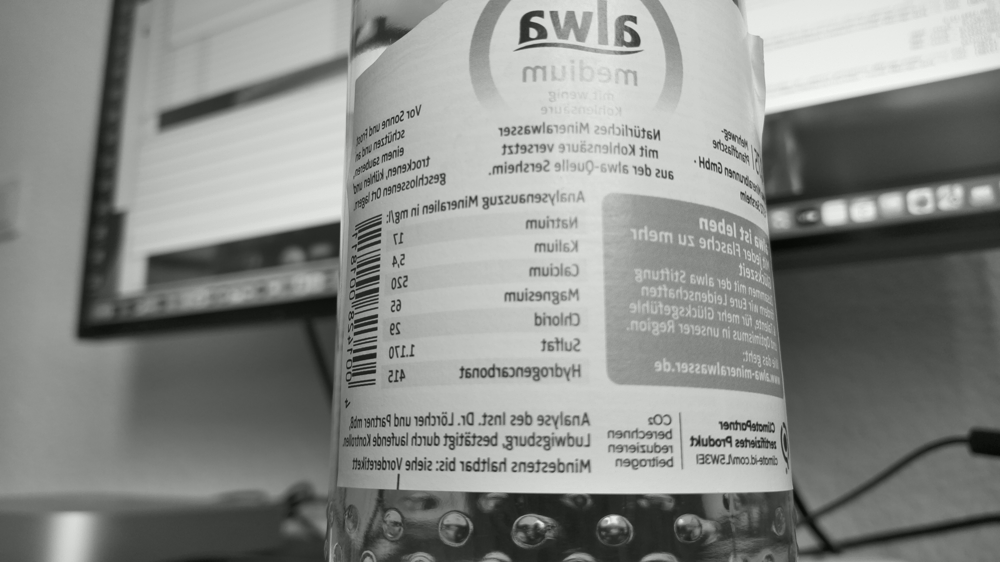

# Raspberry Pi 5 Inno Cam (IMX708) Stream and Capture

This repository contains a script for live streaming and capturing images using the Innomaker IMX708 camera module on a Raspberry Pi 5. The script streams video over UDP to a client and allows capturing still images on the Pi.

## Platform

The script was tested on the following platforms:

### Raspberry Pi OS (Server)

- OS: Debian GNU/Linux bookworm 12.11 aarch64
- Host: Raspberry Pi 5 Model B Rev 1.0
- Kernel: Linux 6.12.25+rpt-rpi-2712
- Shell: zsh 5.9

### macOS (Client)

- OS: macOS Sequoia 15.5 arm64
- Host: Mac mini (M1, 2020)
- Kernel: Darwin 24.5.0
- Shell: zsh 5.9

### Camera

- Innomaker Sensor: imx708 [4608x2592 10-bit RGGB]

## Features

- Start the script via SSH and zsh on the Raspberry Pi.
- Start a live video stream with `rpicam-vid` (UDP).
- Preview the stream on the client using `ffplay` or VLC.
- Press `c` in the script to capture a still image with `rpicam-still`, saved locally on the Pi.

## Requirements

- zsh
- ffplay
- rpicam-apps

## Installation

### Raspberry Pi OS

1. Update the system:
    ```bash
    sudo apt update && sudo apt upgrade
    ```

2. Install camera tools:
    ```bash
    sudo apt install rpicam-apps
    ```

3. Test the camera:
    ```bash
    rpicam-hello --list-cameras
    ```

### macOS

1. Install Homebrew if needed:
    ```zsh
    /bin/bash -c "$(curl -fsSL https://raw.githubusercontent.com/Homebrew/install/HEAD/install.sh)"
    ```

2. Install ffmpeg (provides ffplay):
    ```zsh
    brew install ffmpeg
    ```

---

## Running the Script

On the client:
```zsh
ffplay udp://@:5000
```

On the Raspberry Pi (via SSH):

```zsh
git clone https://github.com/simas2024/RPiTools.git
```

Navigate to the directory where the repository was cloned:
```zsh
cd RPiTools
```

```zsh
./zsh/innocam/capture01.zsh
```

Press `c` to capture a still image (saved on the Pi).

Press `s` to stop the stream and exit the script.

Note: Adjust the IP address (192.168.2.101) in the script to match your client IP.

## Example

<table>
  <tr>
    <th>Scene</th>
    <th>Capture <code>--saturation 0.0</code></th>
  </tr>
  <tr>
    <td></td>
    <td></td>
  </tr>
</table>

## References
 
- [Raspberry Pi Camera Software Documentation](https://www.raspberrypi.com/documentation/computers/camera_software.html)

- [Innomaker Camera](https://github.com/INNO-MAKER/cam-imx708af)
 

