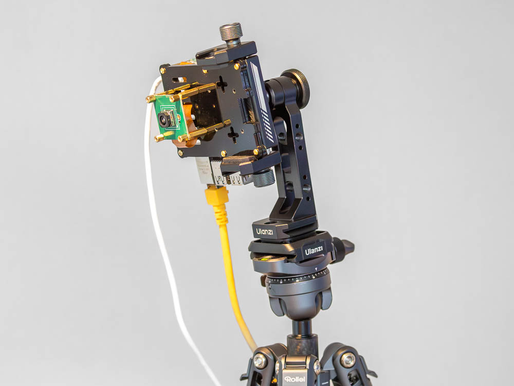
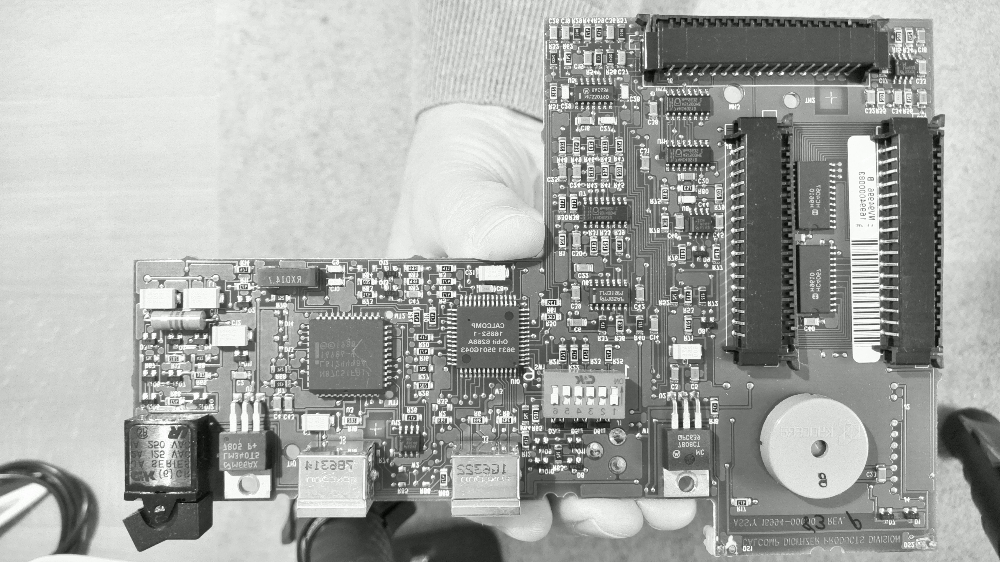
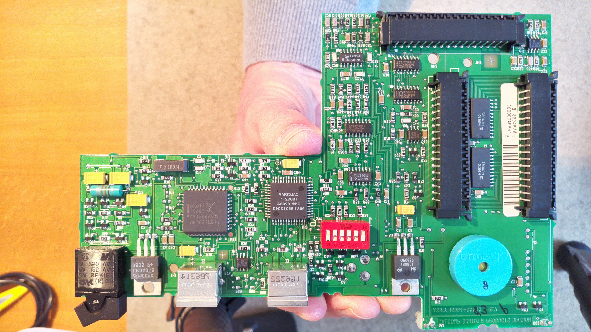

# Raspberry Pi 5 Inno Cam (IMX708) Stream and Capture

This repository contains a script for live streaming and capturing images using the Innomaker IMX708 camera module on a Raspberry Pi 5. The script streams video over UDP to a client and allows capturing still images on the Pi.

<table align="center">
  <tr>
    <th>Inno Cam and Raspberry Pi 5 assembled and mounted on a tripod 😊</th>
  </tr>
  <tr>
    <td align="center">
      
    </td>
  </tr>
</table>


## Platform

Streaming was tested on the following platforms:

### Raspberry Pi OS (Server)

- OS: Debian GNU/Linux bookworm 12.11 aarch64
- Host: Raspberry Pi 5 8GB
- Kernel: Linux 6.12.25+rpt-rpi-2712
- Shell: zsh 5.9

### macOS (Client)

- OS: macOS Sequoia 15.5 arm64
- Kernel: Darwin 24.5.0
- Shell: zsh 5.9

### Windows 11 (Client)

- OS: Windows 11 Pro x86_64
- Kernel: WIN32_NT 10.0.26100.4202 (24H2)
- Shell: Windows PowerShell 5.1.26100.4202

### Camera

- Innomaker Sensor: IMX708 AF [4608x2592 10-bit RGGB]

## Features

* Flexible video streaming options:

  * Default: `rpicam-vid` (UDP).
  * Optional: `gst-launch-1.0` (GStreamer) via the `--gst` option.
  * Use a specific GStreamer binary with the `--gstver` option.
  * Configurable resolution (`--width`, `--height`) and framerate (`--framerate`).
* Preview the video stream on the client using `ffplay` or GStreamer.
* Press `c` in the script to capture a still image with `rpicam-still`, saved locally on the Pi.

When streaming with GStreamer, the `--gstver` option lets you select which
`gst-launch-1.0` binary to run. This is useful if you compiled multiple
versions as described in [README_CompileRPiGS.md](README_CompileRPiGS.md).

## Requirements

* `zsh`
* `rpicam-apps`
* `gst-launch-1.0` (optional, if using GStreamer)
* `ffplay` or GStreamer (to view the video stream on the client)

## Installation

### Raspberry Pi OS

1. Update the system:
    ```bash
    sudo apt update && sudo apt upgrade
    ```

2. Install camera tools and GStreamer packages:
    ```bash
    sudo apt install rpicam-apps gstreamer1.0-libcamera gstreamer1.0-tools \
        gstreamer1.0-plugins-base gstreamer1.0-plugins-good \
        gstreamer1.0-plugins-bad gstreamer1.0-plugins-ugly gstreamer1.0-libav
    ```

   Alternatively you can compile GStreamer yourself from the git repository.
   See [README_CompileRPiGS.md](README_CompileRPiGS.md) for detailed instructions.

3. Test the camera:
    ```bash
    rpicam-hello --list-cameras
    ```

### macOS

1. Install Homebrew if needed:
    ```bash
    /bin/bash -c "$(curl -fsSL https://raw.githubusercontent.com/Homebrew/install/HEAD/install.sh)"
    ```

2. Install ffmpeg (provides ffplay) and GStreamer:
    ```bash
    brew install ffmpeg gstreamer gst-plugins-base gst-plugins-good gst-libav
    ```

### Windows 11

1. Install FFmpeg (includes `ffplay`) and GStreamer (includes `gst-launch-1.0`) via `winget`:

    ```powershell
    winget install --id=Gyan.FFmpeg --source=winget
    winget install GStreamer.GStreamer
    ```

2. Allow UDP port 5000 in Windows Firewall (this might already be done when ffplay starts for the first time).

## Streaming

On the client:

Depending on the streaming mode you selected in the script:

* **If using `rpicam-vid`:**

  On macOS (bash), use:

  ```bash
  ffplay -fflags nobuffer -flags low_delay udp://@:5000
  ```

  On Windows (PowerShell), use:

  ```powershell
  ffplay -fflags nobuffer -flags low_delay udp://0.0.0.0:5000
  ```

* **If using GStreamer (`--gst`):**

  On macOS (bash), use:

  ```bash
  gst-launch-1.0 udpsrc port=5000 caps="application/x-rtp, media=video, encoding-name=H264, payload=96" ! \
      rtph264depay ! h264parse ! avdec_h264 ! videoconvert ! \
      videoflip method=vertical-flip ! videobalance saturation=0.0 ! autovideosink sync=false
  ```

  On Windows (PowerShell), use:

  ```powershell
  & "C:\Program Files\gstreamer\1.0\msvc_x86_64\bin\gst-launch-1.0.exe" `
    udpsrc port=5000 caps="application/x-rtp, media=video, encoding-name=H264, payload=96" `
    ! rtph264depay ! h264parse ! avdec_h264 ! videoconvert `
    ! videoflip method=vertical-flip ! videobalance saturation=0.0 `
    ! autovideosink sync=false
  ```

  On first launch, Windows 11 may prompt you to allow network access for the application. You may need administrator privileges to allow incoming connections on the specified port.


On the Server (Raspberry Pi):

```bash
git clone https://github.com/simas2024/RPiTools.git
```

Navigate to the directory where the repository was cloned, and optionally create a global symlink:

```bash
cd RPiTools
sudo ln -s "$PWD/zsh/innocam/scripts/capture01.zsh" /usr/local/bin/capture
sudo chmod +x /usr/local/bin/capture
```

Alternatively, run it directly from the repository directory:

```bash
cd RPiTools
chmod +x zsh/innocam/scripts/capture01.zsh
./zsh/innocam/scripts/capture01.zsh
```

To use a self-compiled GStreamer version:

```bash
./zsh/innocam/scripts/capture01.zsh --gst --gstver /opt/gstreamer/1.24.3/bin/gst-launch-1.0
```

Show the help to choose the right options and values:

```bash
capture --help
```

or

```bash
./zsh/innocam/scripts/capture01.zsh --help
```

Press `c` to capture a still image (saved on the Pi).

Press `s` to stop the stream and exit the script.

## Example: still image

Object held freehand in front of the camera, captured via `c` during streaming:

<table>
  <tr>
    <th> <code>--saturation 0.0</code></th>
    <th> <code>--saturation 1.0</code></th>
  </tr>
  <tr>
    <td></td>
    <td></td>
  </tr>
</table>

## References

### Documentation
 
- [Raspberry Pi Camera Software Documentation](https://www.raspberrypi.com/documentation/computers/camera_software.html)
- [GStreamer Official Documentation](https://gstreamer.freedesktop.org/documentation/)
- [FFmpeg Tools Documentation (ffplay)](https://ffmpeg.org/ffplay.html)
- [Innomaker Camera](https://github.com/INNO-MAKER/cam-imx708af)

### Source

- [GStreamer Source](https://gitlab.freedesktop.org/gstreamer/gstreamer.git)
 

